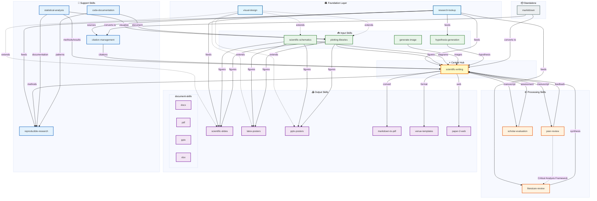

# Skills Dependency Audit

> Comprehensive analysis of skill interactions, workflows, and dependencies
> Generated: 2025-12-30

## Overview

This audit maps the relationships between all 26 skills in the `skills/` folder, identifying which skills interact with others, how they integrate, and which are standalone.

**Skill Count**: 22 top-level skills + 4 document-skills sub-skills = 26 total

> **Note**: Critical analysis capabilities are embedded in `peer-review` (Critical Analysis Framework section), not as a separate skill.

---

## Skill Classification

### Foundational Skills (Referenced by Multiple Others)

| Skill | Dependents | Role |
|-------|------------|------|
| `visual-design` | 5 skills extend it | Design philosophy foundation |
| `research-lookup` | 6+ skills use it | Citation and research discovery |
| `scientific-writing` | Central hub | Integrates input from ~6 skills, outputs to ~4 |

### Extension Hierarchy

```
visual-design (foundation)
├── plotting-libraries
├── scientific-schematics
├── scientific-slides
├── pptx-posters
└── latex-posters
```

All five visual/presentation skills inherit design principles from `visual-design`.

---

## Detailed Skill Analysis

### Writing & Analysis Skills

#### scientific-writing
**Type**: Central Hub
**Purpose**: Core IMRAD manuscript writing with citations and reporting guidelines

**Inbound Dependencies**:
- `research-lookup` - literature search
- `hypothesis-generation` - research hypothesis
- `statistical-analysis` - methods/results data
- `plotting-libraries` - data visualizations
- `scientific-schematics` - diagrams
- `generate-image` - photorealistic figures

**Outbound Dependencies**:
- `citation-management` - organize references
- `peer-review` - get feedback
- `scholar-evaluation` - assess readiness
- `venue-templates` - format for target journal
- `markdown-to-pdf` - final document
- `paper-2-web` - web version

#### literature-review
**Type**: Processing Skill
**Purpose**: Systematic synthesis and analysis of research literature

**Dependencies**:
- Uses: `research-lookup` (to find papers)
- Shares frameworks with: `peer-review` (Critical Analysis Framework)
- Outputs to: `scientific-writing` (for review paper structure)

#### hypothesis-generation
**Type**: Input Skill
**Purpose**: Develops research hypotheses

**Dependencies**:
- Uses: `research-lookup` (ground hypotheses in literature)
- Outputs to: `scientific-writing` (drives research narrative)

**Standalone elements**: Core hypothesis logic is self-contained

> **Note on Critical Analysis**: Critical analysis frameworks (evidence evaluation, bias detection, GRADE hierarchy) are provided by the `peer-review` skill's Critical Analysis Framework section, not as a separate skill.

---

### Research & Citation Skills

#### research-lookup
**Type**: Foundational Input Skill
**Purpose**: Searches research via Perplexity Sonar models

**Downstream Skills**:
- `literature-review`
- `scientific-writing`
- `hypothesis-generation`
- `scientific-slides` (for citations)
- `reproducible-research` (find data repositories)

**Standalone elements**: Model selection logic is self-contained

#### citation-management
**Type**: Support Skill
**Purpose**: Manages scholarly citations and references

**Dependencies**:
- Used by: `scientific-writing` (manuscript citations)
- Receives from: `research-lookup` (found sources)

**Standalone elements**: Citation formatting logic is self-contained

---

### Review & Evaluation Skills

#### peer-review
**Type**: Processing Skill
**Purpose**: Structured peer review with constructive feedback

**Dependencies**:
- Related to: `scholar-evaluation` (assessment vs. review distinction)
- Contains: Critical Analysis Framework (evidence evaluation, bias detection, GRADE)
- Applied to: `scientific-writing` output
- Shared with: `literature-review` (critical analysis frameworks)

**Decision framework**: Use for full review cycle with revision guidance

#### scholar-evaluation
**Type**: Processing Skill
**Purpose**: Quantitative evaluation (8 dimensions, 1-5 scoring)

**Dependencies**:
- Related to: `peer-review` (scholar-evaluation = assessment; peer-review = revisions)
- Applied to: `scientific-writing` output

**Decision framework**: Use for publication readiness assessment

---

### Visualization Skills

#### visual-design
**Type**: Foundation Layer
**Purpose**: Design philosophy (typography, color, layout, accessibility)

**Extended by**:
- `plotting-libraries`
- `scientific-schematics`
- `scientific-slides`
- `pptx-posters`
- `latex-posters`

**Standalone elements**: Design principles, color palettes, chart type matrix

#### plotting-libraries
**Type**: Input Skill (extends visual-design)
**Purpose**: Python (matplotlib/seaborn) and R (ggplot2) visualization

**Dependencies**:
- Extends: `visual-design`
- Feeds into: `scientific-writing`, `scientific-slides`, posters

**Standalone elements**: Code patterns, library-specific syntax

#### scientific-schematics
**Type**: Input Skill (extends visual-design)
**Purpose**: AI-generated diagrams (Nano Banana Pro + Gemini review)

**Dependencies**:
- Extends: `visual-design`
- Feeds into: `scientific-writing`, `scientific-slides`, posters
- Uses: QUANTIFICATION_THRESHOLDS.md for quality scoring

**Decision vs generate-image**: Schematics for diagrams; generate-image for photorealistic

#### generate-image
**Type**: Input Skill
**Purpose**: Photorealistic AI-generated images

**Dependencies**:
- Used by: `scientific-writing` (figure generation)
- Alternative to: `scientific-schematics` (for different use cases)

**Standalone elements**: Image generation prompting

---

### Presentation Skills

#### scientific-slides
**Type**: Output Skill (extends visual-design)
**Purpose**: Research presentations (conference talks, seminars)

**Dependencies**:
- Uses: `research-lookup` (citations)
- Integrates: `scientific-schematics`, `plotting-libraries`
- Extends: `visual-design`

#### latex-posters
**Type**: Output Skill (extends visual-design)
**Purpose**: Research posters in LaTeX format

**Dependencies**:
- Extends: `visual-design`
- Uses: `scientific-schematics`, `plotting-libraries` (figures)
- Alternative to: `pptx-posters`

**Decision framework**: Use for complex equations, version control needed

#### pptx-posters
**Type**: Output Skill (extends visual-design)
**Purpose**: Research posters in PowerPoint format

**Dependencies**:
- Extends: `visual-design`
- Uses: `scientific-schematics`, `plotting-libraries` (figures)
- Alternative to: `latex-posters`

**Decision framework**: Use for fast turnaround (<48 hours), collaborative editing

---

### Document Output Skills

#### markdown-to-pdf
**Type**: Output Skill
**Purpose**: Converts markdown to branded PDF (Oligon styling)

**Dependencies**:
- Receives from: `scientific-writing` (manuscript markdown)
- Alternative to: `document-skills/pdf` (markdown-to-pdf is specialized)

**Standalone elements**: 12 document type templates, YAML schemas

#### document-skills
**Type**: Output Skill Suite
**Purpose**: Document generation with 4 sub-skills

| Sub-skill | Format | Notes |
|-----------|--------|-------|
| `docx` | Word | General document output |
| `pdf` | PDF | General PDF (vs branded markdown-to-pdf) |
| `pptx` | PowerPoint | Presentation output |
| `xlsx` | Excel | Spreadsheet output |

**Dependencies**:
- Receives from: Various content skills
- Used by: `markdown-to-pdf` references as alternative

#### venue-templates
**Type**: Output Skill
**Purpose**: Journal/conference formatting requirements

**Dependencies**:
- Used by: `scientific-writing` (format for target venue)
- Integrates: Suggests `scientific-schematics` for document types

**Standalone elements**: 50+ journal templates, conference formats

#### paper-2-web
**Type**: Output Skill
**Purpose**: Converts papers to web-optimized HTML

**Dependencies**:
- Receives from: `scientific-writing`

**Standalone elements**: HTML conversion logic

#### markitdown
**Type**: Input/Processing Skill
**Purpose**: Converts various formats to markdown

**Dependencies**:
- Outputs to: `scientific-writing`, `citation-management`
- Inverse of: `markdown-to-pdf`

---

### Analysis & Reproducibility Skills

#### statistical-analysis
**Type**: Support Skill
**Purpose**: Test selection decision trees and method guidance

**Dependencies**:
- Input to: `scientific-writing` (Methods/Results)
- Used by: `reproducible-research` (documentation)

**Standalone elements**: Test selection matrix, correction methods

#### reproducible-research
**Type**: Support Skill
**Purpose**: Environment specs, data deposition, FAIR compliance

**Dependencies**:
- Input from: `scientific-writing` (Methods section)
- Uses: `research-lookup` (find repositories)
- Integrates: `code-documentation`
- Uses: QUANTIFICATION_THRESHOLDS.md for scoring

#### code-documentation
**Type**: Support Skill
**Purpose**: Documents code with docstrings and comments

**Dependencies**:
- Related to: `reproducible-research`

**Mostly standalone**: Core documentation patterns are self-contained

---

## Workflow Patterns

### Pattern 1: Research Paper Pipeline

```
research-lookup ─────┐
                     │
hypothesis-generation─┤
                     │
statistical-analysis ─┼──► scientific-writing ──► peer-review ──► venue-templates
                     │         │                       │
plotting-libraries ──┤         │                       ▼
                     │         │              scholar-evaluation
scientific-schematics┤         │
                     │         ▼
citation-management ─┘    markdown-to-pdf ──► paper-2-web (optional)
```

### Pattern 2: Conference Presentation

```
research-lookup ──────┐
                      │
scientific-schematics─┼──► scientific-slides
                      │
plotting-libraries ───┤
                      │
visual-design ────────┘ (extends)
```

### Pattern 3: Research Poster

```
scientific-writing ──► latex-posters (complex equations)
        │                    │
        │                    ▼
        │              visual-design (extends)
        │
        └────────────► pptx-posters (fast turnaround)
                             │
                             ▼
                       visual-design (extends)
```

### Pattern 4: Reproducibility Pipeline

```
scientific-writing (Methods) ──► reproducible-research
                                       │
                     ┌─────────────────┼─────────────────┐
                     ▼                 ▼                 ▼
            code-documentation   research-lookup   FAIR checklist
                                (find data repos)
```

### Pattern 5: Literature Review

```
research-lookup ──► literature-review ──► scientific-writing
                          │
                          ▼
                    peer-review
                (Critical Analysis Framework)
                          │
                          ├─ Evidence evaluation
                          ├─ Bias detection
                          └─ GRADE hierarchy
```

---

## Standalone Skills

These skills have minimal or no dependencies on other skills:

| Skill | Notes |
|-------|-------|
| `code-documentation` | Self-contained documentation patterns |
| `markitdown` | Self-contained format conversion |
| `generate-image` | Self-contained image generation |
| `statistical-analysis` | Self-contained test selection (used by others) |

---

## Shared Resources

### QUANTIFICATION_THRESHOLDS.md

Referenced by:
- `scientific-schematics` (quality scoring)
- `scientific-writing` (writing quality rubrics)
- `reproducible-research` (completeness scoring)

### SKILL_ROUTER.md

Master routing document that defines:
- Decision trees for skill selection
- Task-to-skill mapping matrix
- Multi-skill workflow patterns
- Document output decision tree

---

## Dependency Summary Table

| Skill | Depends On | Depended By | Type |
|-------|------------|-------------|------|
| visual-design | - | 5 skills | Foundation |
| research-lookup | - | 6+ skills | Foundation |
| scientific-writing | 6 skills | 6 skills | Hub |
| plotting-libraries | visual-design | 3 skills | Input |
| scientific-schematics | visual-design | 4 skills | Input |
| scientific-slides | 4 skills | - | Output |
| latex-posters | 3 skills | - | Output |
| pptx-posters | 3 skills | - | Output |
| markdown-to-pdf | scientific-writing | - | Output |
| peer-review | 2 skills | scientific-writing | Processing |
| scholar-evaluation | peer-review | scientific-writing | Processing |
| literature-review | 3 skills | scientific-writing | Processing |
| citation-management | research-lookup | scientific-writing | Support |
| statistical-analysis | - | 2 skills | Support |
| reproducible-research | 3 skills | - | Support |
| code-documentation | - | reproducible-research | Standalone |
| generate-image | - | scientific-writing | Standalone |
| markitdown | - | 2 skills | Standalone |
| venue-templates | - | scientific-writing | Output |
| paper-2-web | scientific-writing | - | Output |
| hypothesis-generation | research-lookup | scientific-writing | Input |
| document-skills/* | - | - | Output |

> **Note**: Critical analysis capabilities are provided by `peer-review` (Critical Analysis Framework section).

---

## Dependency Visualization

### Complete Skill Relationship Map



### Diagram Legend

| Color | Type | Count | Description |
|-------|------|-------|-------------|
| 🔵 Light Blue | Foundation | 2 | Core skills extended by others |
| 🟡 Yellow | Hub | 1 | Central integration point |
| 🟢 Green | Input | 4 | Generate content for manuscripts |
| 🟠 Orange | Processing | 3 | Transform or evaluate content |
| 🟣 Purple | Output | 10 | Produce final deliverables |
| 🔷 Blue | Support | 4 | Auxiliary capabilities |
| ⬜ Gray | Standalone | 1 | Minimal dependencies |

### Key Relationships

**Extension Hierarchy (dotted lines):**
- `visual-design` → 5 visual/presentation skills

**Primary Data Flow (solid lines):**
- `research-lookup` → 5 downstream skills
- `scientific-writing` ↔ 12 connected skills (6 inbound, 6 outbound)

**Framework Sharing:**
- `peer-review` shares Critical Analysis Framework with `literature-review`

---

## Recommendations

### For New Skill Development

1. **Check if extending visual-design**: Any visual/presentation skill should extend visual-design
2. **Integrate with research-lookup**: Research-related skills should receive input from research-lookup
3. **Connect to scientific-writing**: Writing-related skills should integrate with the central hub

### For Skill Maintenance

1. **Update SKILL_ROUTER.md** when adding skills with decision points
2. **Update QUANTIFICATION_THRESHOLDS.md** if skill needs quality metrics
3. **Document cross-references** in each skill's SKILL.md

### Identified Gaps

1. **No direct link**: `statistical-analysis` → `plotting-libraries` (could integrate for statistical visualization guidance)
2. **Consider adding**: `code-documentation` → `plotting-libraries` (for plot generation code documentation patterns)

---

## Implementation Plan

### Phase 1: Address Identified Gaps (Priority: High)

#### 1.1 Link statistical-analysis → plotting-libraries

**Goal**: Add guidance for visualizing statistical results

**Files to modify**:
- `skills/statistical-analysis/SKILL.md`
- `skills/plotting-libraries/SKILL.md`

**Steps**:
1. Read current `statistical-analysis/SKILL.md` cross-references section
2. Add cross-reference to `plotting-libraries` with context:
   - "For visualizing test results, distributions, and model diagnostics"
   - Link to specific plot types: box plots (group comparisons), Q-Q plots (normality), residual plots (regression)
3. Read current `plotting-libraries/SKILL.md`
4. Add "Statistical Visualization" section or cross-reference:
   - Reference `statistical-analysis` for choosing appropriate visualizations
   - Add examples: confidence interval plots, forest plots, correlation matrices
5. Update SKILL_ROUTER.md with statistical visualization decision path

**Acceptance criteria**:
- [ ] statistical-analysis mentions plotting-libraries in cross-references
- [ ] plotting-libraries has statistical visualization guidance
- [ ] SKILL_ROUTER.md includes "visualize statistical results" routing

#### 1.2 Link code-documentation → plotting-libraries

**Goal**: Add patterns for documenting plot generation code

**Files to modify**:
- `skills/code-documentation/SKILL.md`
- `skills/plotting-libraries/SKILL.md`

**Steps**:
1. Read current `code-documentation/SKILL.md`
2. Add section or cross-reference for "Visualization Code Documentation":
   - Docstring patterns for plotting functions
   - Parameter documentation for figure customization
   - Example documentation for common plot types
3. Add cross-reference to `plotting-libraries`
4. In `plotting-libraries/SKILL.md`, add note about documentation standards
5. Consider adding example documented plotting function in references/

**Acceptance criteria**:
- [ ] code-documentation mentions plotting-libraries
- [ ] Pattern for documenting plotting functions exists
- [ ] plotting-libraries references documentation standards

---

### Phase 2: Strengthen Cross-References (Priority: Medium)

#### 2.1 Audit existing cross-references for completeness

**Goal**: Ensure all skills have accurate cross-references

**Steps**:
1. For each skill, verify cross-references match this audit's findings
2. Check that bidirectional relationships are documented both ways
3. Add missing cross-references identified in dependency table

**Skills to check** (prioritized by connection count):
| Priority | Skill | Expected Connections |
|----------|-------|---------------------|
| 1 | scientific-writing | 12 connections |
| 2 | research-lookup | 6+ connections |
| 3 | visual-design | 5 extensions |
| 4 | plotting-libraries | 3 dependencies |
| 5 | scientific-schematics | 4 dependencies |

**Acceptance criteria**:
- [x] All hub skills (scientific-writing, research-lookup, visual-design) have complete cross-references
- [x] Extension relationships documented in both parent and child skills

#### 2.2 Standardize cross-reference format

**Goal**: Consistent cross-reference sections across all skills

**Proposed format**:
```markdown
## Cross-References

### Extends
- `visual-design` - inherits design principles

### Uses (Input From)
- `research-lookup` - literature citations

### Feeds (Output To)
- `scientific-writing` - provides figures

### Related
- `generate-image` - alternative for photorealistic images
```

**Steps**:
1. Document standard format in SKILL_TEMPLATE.md
2. Update skills with highest connection counts first
3. Validate format consistency across all skills

**Acceptance criteria**:
- [x] SKILL_TEMPLATE.md includes cross-reference format
- [x] Top 5 connected skills use standardized format

---

### Phase 3: Update Routing Documentation (Priority: Medium)

#### 3.1 Add missing decision trees to SKILL_ROUTER.md

**Goal**: Complete coverage of skill selection scenarios

**Steps**:
1. Review current SKILL_ROUTER.md decision trees
2. Add decision tree for: "I need to visualize data"
   ```
   Data visualization needed?
   ├── Statistical results → statistical-analysis + plotting-libraries
   ├── Scientific diagram → scientific-schematics
   ├── Photorealistic image → generate-image
   └── Publication figure → plotting-libraries (extends visual-design)
   ```
3. Add decision tree for: "I need to document my work"
   ```
   Documentation type?
   ├── Code documentation → code-documentation
   ├── Reproducibility → reproducible-research
   ├── Methods section → scientific-writing
   └── Data availability → reproducible-research
   ```

**Acceptance criteria**:
- [x] Visualization decision tree added (existed in "Decision Tree: Figure & Visual Creation" + "Statistical Visualization Routing")
- [x] Documentation decision tree added ("Decision Tree: Documentation & Work Archiving")
- [x] All 26 skills reachable via some decision path

#### 3.2 Update task-to-skill matrix

**Goal**: Ensure matrix reflects current skill capabilities

**Steps**:
1. Review existing task-to-skill matrix in SKILL_ROUTER.md
2. Add rows for newly identified workflows:
   - "Visualize statistical results"
   - "Document plotting code"
   - "Create reproducible analysis"
3. Verify all skills appear in at least one task row

**Acceptance criteria**:
- [x] Matrix includes all 26 skills
- [x] New workflow rows added (Visualize statistical results, Document plotting code, Create reproducible analysis)

---

### Phase 4: Quality Metrics Integration (Priority: Low) ✅ COMPLETE

#### 4.1 Create QUANTIFICATION_THRESHOLDS.md

**Goal**: Create shared thresholds document and add quality metrics for skills that lack them

**File created**: `skills/QUANTIFICATION_THRESHOLDS.md` (v1.0.0)

**Sections implemented**:
- §1 Literature Coverage (referenced by literature-review, hypothesis-generation, scientific-writing)
- §2 Visual Quality (visual-design, peer-review, generate-image, plotting-libraries)
- §3 Replication & Sample Size (peer-review, hypothesis-generation, statistical-analysis)
- §4 Issue Severity Classification (peer-review, scholar-evaluation)
- §5 Documentation Completeness (reproducible-research, code-documentation)
- §6 Time-Based Thresholds (literature-review, research-lookup)
- §7 Quality Scoring Rubrics (scientific-writing, scientific-schematics, peer-review, generate-image)
- §8 Iteration & Stopping Criteria (scientific-schematics, generate-image)
- §9 Figure & Plot Quality **NEW** (plotting-libraries, visual-design)
- §10 Statistical Reporting Completeness **NEW** (statistical-analysis, scientific-writing, peer-review)

**Skills updated**:
- `plotting-libraries` (v1.1.0 → v1.2.0) - references §2, §7.2, §9
- `statistical-analysis` (added v1.1.0) - references §3, §10, §4
- `literature-review` - already referenced §1, §6 (verified)

**Acceptance criteria**:
- [x] At least one new skill added to QUANTIFICATION_THRESHOLDS.md (plotting-libraries, statistical-analysis)
- [x] Skill cross-references updated to mention thresholds

---

### Phase 5: Documentation & Validation (Priority: Low) ✅ COMPLETE

#### 5.1 Update SKILL_TEMPLATE.md

**Goal**: Template reflects best practices from this audit

**Completed in Phase 2.2**: SKILL_TEMPLATE.md already includes:
- Cross-reference section template (lines 226-260) with Extends/Uses/Feeds/Related structure
- Skill Integration Checklist (lines 294-301) covering all integration requirements

**Steps** (verified complete):
1. ✅ Cross-reference section template exists
2. ✅ "Extends" relationship documentation included
3. ✅ Checklist for new skill creation added:
   - ✅ Checked if should extend visual-design
   - ✅ Identified input skills (what feeds this skill)
   - ✅ Identified output skills (what this skill feeds)
   - ✅ Added to SKILL_ROUTER.md decision tree
   - ✅ Considered QUANTIFICATION_THRESHOLDS.md metrics

**Acceptance criteria**:
- [x] SKILL_TEMPLATE.md updated with relationship documentation
- [x] New skill checklist added

#### 5.2 Create dependency visualization

**Goal**: Visual diagram of skill relationships

**Completed**: Mermaid diagram added to "Dependency Visualization" section (above Recommendations)

**Implementation**:
- Flowchart showing all 26 skills organized by type
- Subgraphs for: Foundation, Hub, Input, Processing, Output, Support, Standalone
- Color-coded by skill type with class definitions
- Shows extension hierarchy (dotted lines) and data flow (solid lines)
- Includes legend table and key relationship summary

**Acceptance criteria**:
- [x] Mermaid diagram added to audit document
- [x] All 26 skills represented (22 top-level + 4 document-skills sub-skills)

---

## Implementation Timeline

| Phase | Tasks | Estimated Effort | Dependencies |
|-------|-------|------------------|--------------|
| 1 | Address identified gaps | 2-3 hours | None |
| 2 | Strengthen cross-references | 3-4 hours | Phase 1 |
| 3 | Update routing documentation | 2-3 hours | Phase 2 |
| 4 | Quality metrics integration | 2-3 hours | Phase 1 |
| 5 | Documentation & validation | 1-2 hours | Phases 1-4 |

**Total estimated effort**: 10-15 hours

---

## Quick Start: Phase 1 Commands

```bash
# 1.1 - Link statistical-analysis → plotting-libraries
# Files to edit:
code skills/statistical-analysis/SKILL.md
code skills/plotting-libraries/SKILL.md
code skills/SKILL_ROUTER.md

# 1.2 - Link code-documentation → plotting-libraries
# Files to edit:
code skills/code-documentation/SKILL.md
code skills/plotting-libraries/SKILL.md
```

---

*Audit generated from analysis of all SKILL.md files and SKILL_ROUTER.md*
